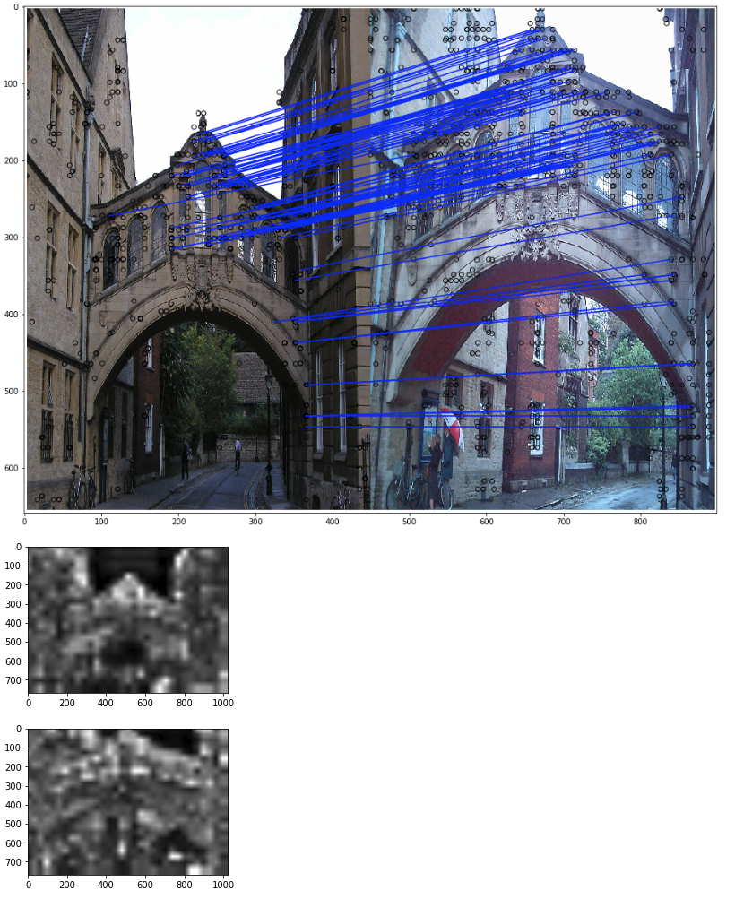
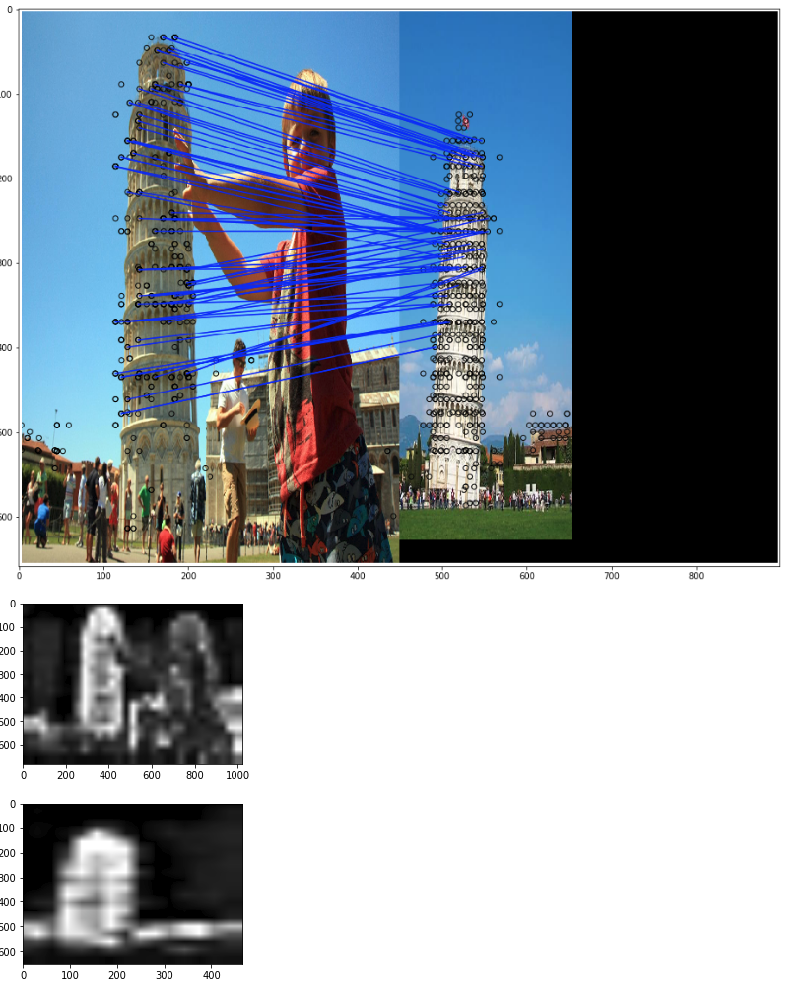
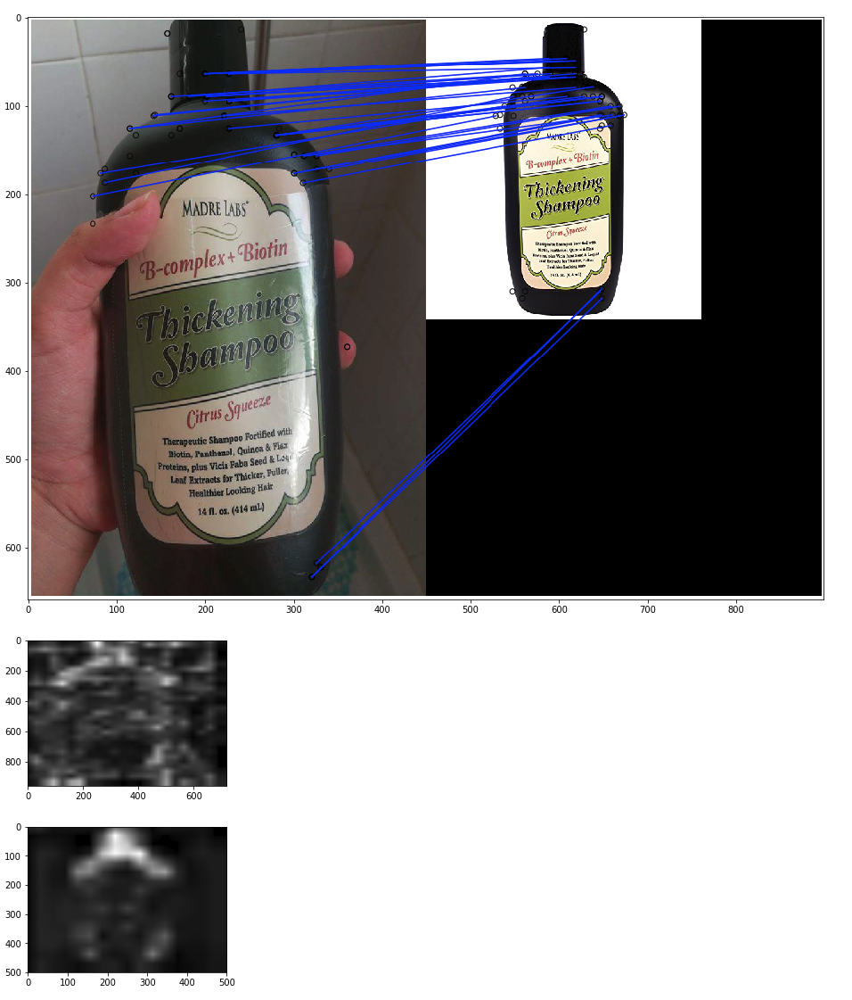

# DELF: DEep Local Features

This project is wrapper of [DELF Tensorflow code](https://github.com/tensorflow/models/tree/master/research/delf) (introduced
in the paper ["Large-Scale Image Retrieval with Attentive Deep Local
Features"](https://arxiv.org/abs/1612.06321)) which is more easy to use for below reasons:

* No bell and whistle for setup. All required packages are prepared.
* Modularized code. You can easily import as python package from any of your fantastic project. 
    * Get Local Descriptors from any image
    * Get Attention Image, so you can see why the DELFs are selected
    * Get Matching Image, so you can see why the image pair has high score
* [DEMO Python Notebook](https://oss.navercorp.com/case/delf/blob/notebook/Feature%20Matching.ipynb) provide how to import and use this wrapper.
* You also can load weight on a model build with its code. 
    * You now have full access on any tensors in the graph, such as attention
    * You can play with code level instead of just reproducing with exported model. 

## What is DELF? Why is it good?

According to README in [DELF Tensorflow code](https://github.com/tensorflow/models/tree/master/research/delf)
> DELF is particularly useful for large-scale instance-level image recognition. It
detects and describes semantic local features which can be geometrically
verified between images showing the same object instance. The pre-trained model
released here has been optimized for landmark recognition, so expect it to work
well in this area.


## Matching, Attention Image Samples
<table align='center'>
<tr align='center'>
<td> Image in Landmark Dataset </td>
<td> Pisa. See the power of attention </td>
<td> For non-landmark, attention don't work </td>
</tr>
<tr>
<td>
<td>
<td>
</tr>
</table>

# TODO

Any contributions are welcome :smile:

[ ] write batch inference code. (one-by-one inference is too slow for any online application)

[ ] write export script for serving

[ ] write code for fine-tuning, and attention training

 
If you make use of this code, please consider citing:

## Installation

```
# Python 3

# Tensorflow 1.3
pip install tensorflow==1.3

# OpenCV
pip install opencv-contrib-python

```

To be able to use this code, please follow [these
instructions](INSTALL_INSTRUCTIONS.md) to properly install the DELF library.

Please add path so `delf` can import these models. 

```
cd ./slim
pip install -e . # install slim as package
cd ..
export PYTHONPATH=$PYTHONPATH:`pwd`
export PATH_TO_PROTOC=`pwd`
```

If you want to use this one as package, install this to your python env with below command

```
# In root dir of thie repo
sudo pip install -e .
```

# Acknowledgement
```
"Large-Scale Image Retrieval with Attentive Deep Local Features",
Hyeonwoo Noh, Andre Araujo, Jack Sim, Tobias Weyand, Bohyung Han,
Proc. ICCV'17
```